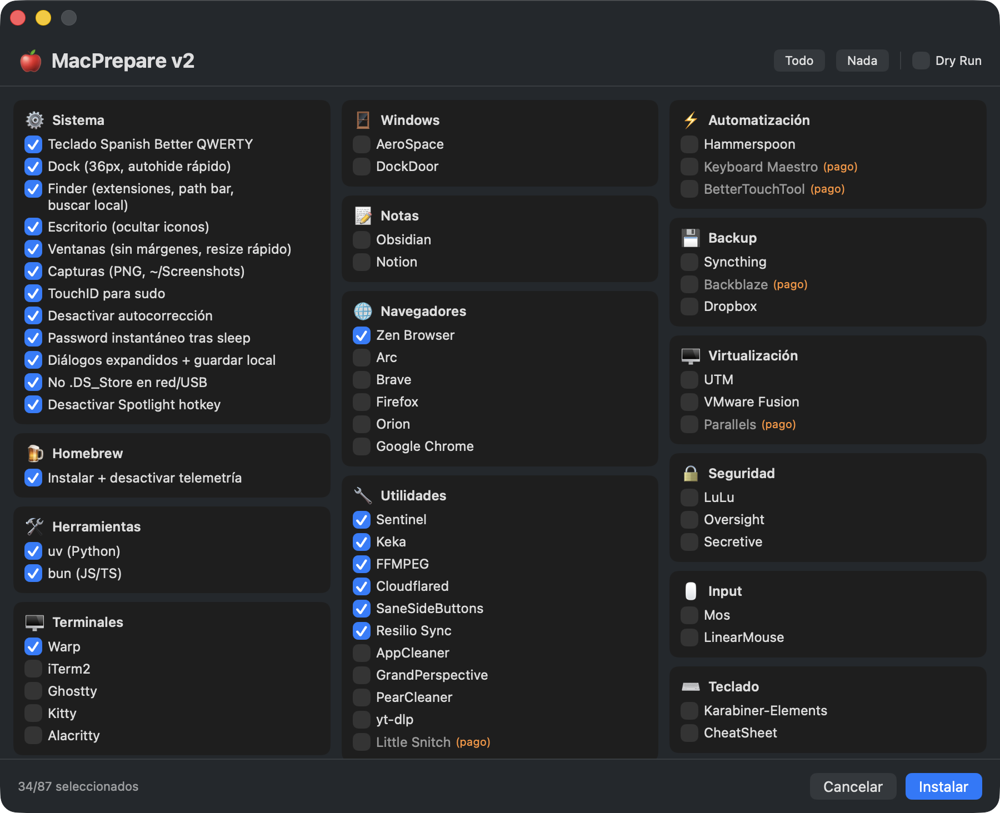

# MacPrepare

Configura tu Mac en un solo comando.

```bash
zsh <(curl -fsSL https://raw.githubusercontent.com/miwgel/MacPrepare/main/install.sh)
```



## Qué hace

Abre una interfaz gráfica nativa donde puedes seleccionar:

- Configuraciones del sistema (Dock, Finder, capturas de pantalla, etc.)
- Herramientas de desarrollo (VS Code, Git, Docker, uv, bun)
- Terminales (Warp, iTerm2, Ghostty, Kitty, Alacritty)
- Apps de productividad (Raycast, Obsidian, Rectangle)
- Navegadores, utilidades, multimedia y más

Todas las instalaciones usan [Homebrew](https://brew.sh). Si no lo tienes, se instala automáticamente.

## Requisitos

- macOS
- Xcode Command Line Tools (se instalan automáticamente si no las tienes)
