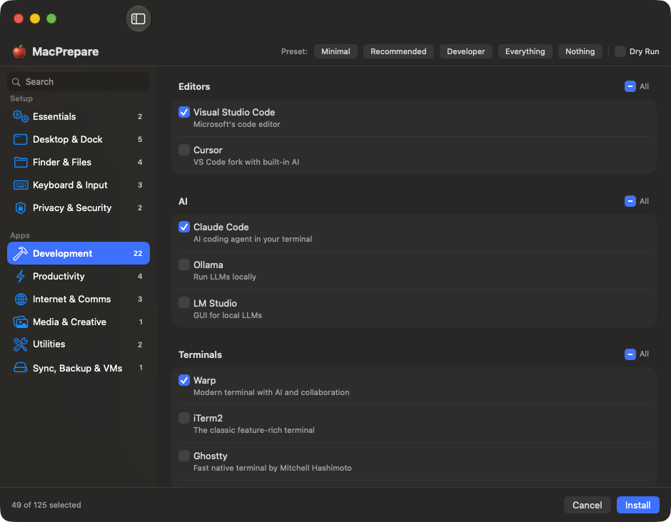

# MacPrepare

Set up a fresh Mac in one command.

```bash
zsh <(curl -fsSL https://raw.githubusercontent.com/miwgel/MacPrepare/main/install.sh)
```



## What it does

Opens a native SwiftUI app where you pick exactly what you want, then installs and configures everything in one go — with live per-item progress.

### Setup

- **Essentials** — Homebrew (telemetry disabled) and an up-to-date Git
- **Desktop & Dock** — Dock tuning, clean desktop, window managers (AltTab, Rectangle, AeroSpace, DockDoor), menu bar apps (Ice, Stats, Itsycal, MeetingBar)
- **Finder & Files** — sensible Finder defaults, screenshots to `~/Screenshots`, Keka, AppCleaner, torrent clients
- **Keyboard & Input** — disable autocorrect, free up ⌘Space for your launcher, Karabiner, Espanso, SaneSideButtons, LinearMouse
- **Privacy & Security** — Touch ID for sudo, instant lock, LuLu, Little Snitch, password managers (Bitwarden, KeePassXC, 1Password), Tailscale

### Apps

- **Development** — VS Code, Cursor, Claude Code, Ollama, terminals (Warp, iTerm2, Ghostty, Kitty, Alacritty), modern CLI stack (mise, uv, bun, ripgrep, fzf, fd, bat, eza, zoxide, lazygit, starship, gh, jq, btop…), OrbStack, Docker, Bruno, TablePlus
- **Productivity** — Raycast, Maccy, Shottr, Superwhisper, Obsidian, Notion
- **Internet & Comms** — Zen, Helium, Arc, Brave, Firefox, Orion, Chrome, WhatsApp, Discord, Telegram, Slack, Signal, Thunderbird, NetNewsWire
- **Media & Creative** — OBS, IINA, VLC, Kap, Figma, Blender, ImageOptim, Pika, Steam
- **Utilities** — MonitorControl, BetterDisplay, AlDente, KeepingYouAwake, Latest
- **Sync, Backup & VMs** — Syncthing, Resilio Sync, Dropbox, Backblaze, UTM, VMware Fusion, Parallels

## Highlights

- **Presets** — start from Minimal, Recommended, Developer, Everything or Nothing, then fine-tune
- **Search** — filter the whole catalog by name or description
- **Honest results** — failed installs show up red, not silently green
- **One password prompt max** — only the Touch ID/sudo tweak elevates; everything else runs as you
- **Dry Run** — preview the whole run without touching your system
- **Idempotent** — already-installed apps are detected and skipped; safe to run again anytime

Everything installs through [Homebrew](https://brew.sh). If you don't have it, it's installed automatically (with analytics disabled).

## Requirements

- macOS (Apple Silicon or Intel)
- Xcode Command Line Tools (installed automatically if missing)

## Debugging

```bash
zsh <(curl -fsSL https://raw.githubusercontent.com/miwgel/MacPrepare/main/install.sh) --debug
```

Prints per-item command output, exit codes and timings to the terminal.
